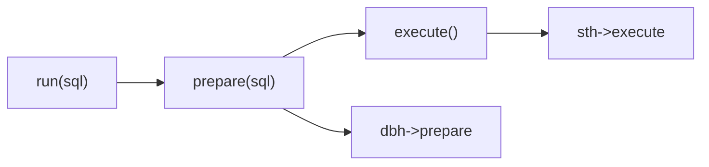
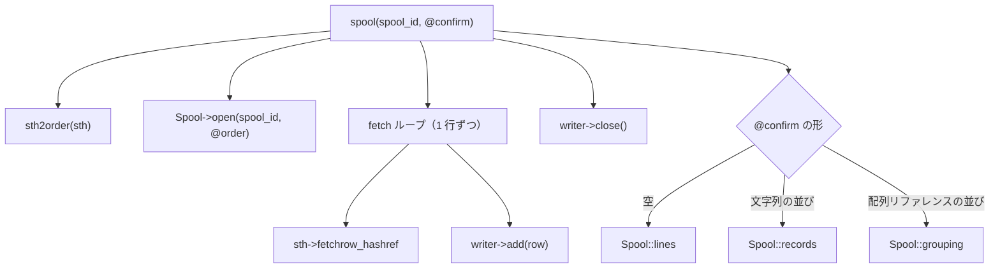
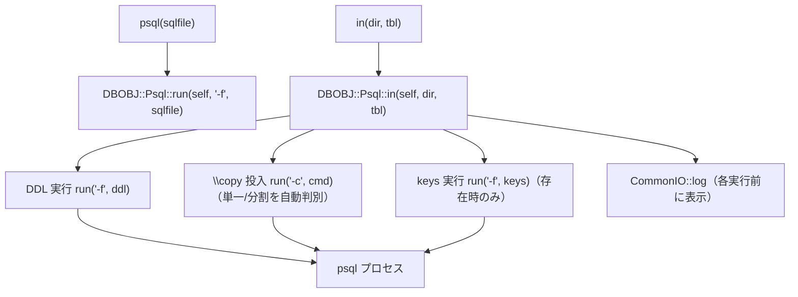

# DBOBJ コールグラフ

Date: 2026-06-12

[src/DBOBJ.pm](../src/DBOBJ.pm) の関数呼び出し関係を Mermaid 形式で示す。
対象は DBOBJ・DBOBJ::Psql 内部の呼び出しと、外部ライブラリ（CommonIO・MetaAoh・Spool）・DBI・psql プロセスへの呼び出しである。

## 全体コールグラフ

```mermaid
flowchart TB
    subgraph PUBLIC["DBOBJ 公開 API"]
        new["new(dbname)"]
        prepare["prepare(sql)"]
        execute["execute(@bind)"]
        run["run(sql)"]
        get["get()"]
        list["list()"]
        arrays["arrays()"]
        hashes["hashes()"]
        spool["spool(spool_id, @confirm)"]
        psql["psql(sqlfile)"]
        in_["in(dir, tbl)"]
        close_["close()"]
    end

    subgraph INTERNAL["DBOBJ 内部関数"]
        sth2order["sth2order(sth)"]
    end

    subgraph PSQLPKG["DBOBJ::Psql（同一ファイル内の独立パッケージ）"]
        psql_run["DBOBJ::Psql::run(dbo, @args)"]
        psql_in["DBOBJ::Psql::in(dbo, dir, tbl)"]
    end

    subgraph COMMONIO["CommonIO"]
        dying["dying(msg)"]
        log["log('info', msg)"]
    end

    subgraph METAAOH["MetaAoh"]
        metaaoh_new["MetaAoh->new(rows, @order)"]
    end

    subgraph SPOOL["Spool"]
        spool_open["Spool->open(spool_id, @order)"]
        spool_add["writer->add(row)"]
        spool_close["writer->close()"]
        spool_lines["Spool::lines(spool_id)"]
        spool_records["Spool::records(spool_id, @cols)"]
        spool_grouping["Spool::grouping(spool_id, @groups)"]
    end

    subgraph DBILIB["DBI"]
        dbi_connect["DBI->connect"]
        dbh_do["dbh->do"]
        dbh_prepare["dbh->prepare"]
        sth_execute["sth->execute"]
        sth_fetchall["sth->fetchall_arrayref"]
        sth_fetchrow["sth->fetchrow_hashref"]
        sth_finish["sth->finish"]
        dbh_disconnect["dbh->disconnect"]
    end

    subgraph PROC["外部プロセス"]
        psql_cmd["psql --set ON_ERROR_STOP=1"]
    end

    new --> dbi_connect
    new --> dbh_do
    new --> dying

    prepare --> sth_finish
    prepare --> dbh_prepare
    prepare --> dying

    execute --> sth_execute
    execute --> dying

    run --> prepare
    run --> execute

    get --> sth_fetchall
    get --> dying

    list --> sth_fetchall
    list --> dying

    arrays --> sth_fetchall

    hashes --> sth_fetchall
    hashes --> sth2order
    hashes --> metaaoh_new

    spool --> sth2order
    spool --> spool_open
    spool --> sth_fetchrow
    spool --> spool_add
    spool --> spool_close
    spool --> spool_lines
    spool --> spool_records
    spool --> spool_grouping
    spool --> dying

    psql --> psql_run
    in_ --> psql_in

    psql_in --> psql_run
    psql_in --> log
    psql_in --> dying

    psql_run --> psql_cmd
    psql_run --> dying

    close_ --> sth_finish
    close_ --> dbh_disconnect
```

## API 別の呼び出しフロー

### run() — prepare + execute の合成

`run()` は DBOBJ 内で唯一、公開 API から公開 API を呼ぶ合成メソッドである。

### 取得系 4 API — undef の '' 置換

`get()` / `list()` / `arrays()` / `hashes()` はいずれも defined-or（`// ''` / `//= ''`）で
DB 取得値の `undef` を `''` へ置き換える。専用の内部関数は持たない。

### spool() — 退避と確定モードの振り分け

`spool()` は write フェーズのあと、`@confirm` の形で確定モードを振り分ける。
正しさのチェックはせず、違反は Spool / MetaAoh の実行時 die が捕まえる。

### psql() / in() — DBOBJ::Psql への委譲

接続情報は `new()` で内部状態へ取り込んだ値（`dbname`・`host`・`port`・`user`）を
DBOBJ オブジェクトごと渡す。Psql は `%ENV` を直接読まない（`PGPASSWORD` のみ
環境変数のまま psql 子プロセスへ引き継ぐ）。

## 関数別呼び出し一覧

| 呼び出し元 | DBOBJ / Psql 内部 | 外部ライブラリ | DBI / プロセス |
|---|---|---|---|
| `new()` | ― | `dying()` | `DBI->connect`, `dbh->do` |
| `prepare()` | ― | `dying()` | `sth->finish`, `dbh->prepare` |
| `execute()` | ― | `dying()` | `sth->execute` |
| `run()` | `prepare()`, `execute()` | ― | ― |
| `get()` | ― | `dying()` | `sth->fetchall_arrayref` |
| `list()` | ― | `dying()` | `sth->fetchall_arrayref` |
| `arrays()` | ― | ― | `sth->fetchall_arrayref` |
| `hashes()` | `sth2order()` | `MetaAoh->new` | `sth->fetchall_arrayref` |
| `spool()` | `sth2order()` | `dying()`, `Spool->open` / `add` / `close`, `Spool::lines` / `records` / `grouping` | `sth->fetchrow_hashref` |
| `psql()` | `DBOBJ::Psql::run` | ― | ― |
| `in()` | `DBOBJ::Psql::in` | ― | ― |
| `close()` | ― | ― | `sth->finish`, `dbh->disconnect` |
| `sth2order()` | ― | ― | ― |
| `DBOBJ::Psql::run()` | ― | `dying()` | `system(psql)` |
| `DBOBJ::Psql::in()` | `DBOBJ::Psql::run()` | `dying()`, `CommonIO::log` | ― |

## 補足

- エラー検知は `CommonIO::dying()` に集約されており、`arrays()`・`run()`・`close()`・`sth2order()` 以外の全関数から呼ばれる。
- `sth2order()` は副作用のない純関数であり、`hashes()` と `spool()` が schema 規則（str は `NAME`、num は `NAME#`）を共有するための唯一の内部変換関数である。
- 接続オブジェクトの内部状態（`dbname`・`host`・`port`・`user`・`dbh`・`sth`）の定義は
  [design-concept.md](design/design-concept.md) を参照する。
